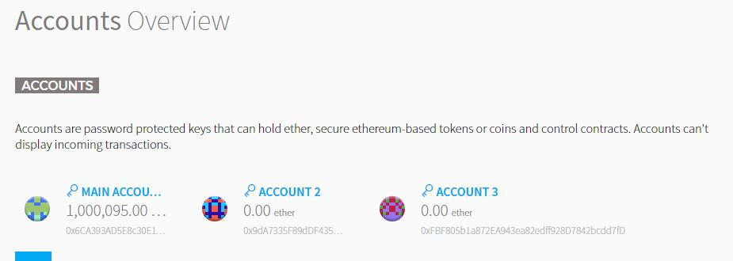

# Connect to a network using the Ethereum Wallet #

The Ethereum Wallet is a useful application that can be used to inspect contracts, accounts, transactions 
and events on the chain. This walk through will step you through using the wallet to deploy and interact with 
a contract.

1. **Install and launch the Ethereum Wallet**

    * Install and launch using PowerShell

            ./00.Setup/windows/LaunchEthereumWallet.ps1
    
    * Manually Download the [Ethereum Wallet]
    * Extract the files
    * Launch "Ethereum Wallet.exe"

    Note: that by default if there is no local geth instance running the Ethereum Wallet will launch it's own local
    copy of geth that will by default attempt to connect to the active public network. The wallet may also be switched
    to connect to the test network and enable mining.

    Note: this sample assumes that the steps in the [Local Blockchain](../01.LocalBlockchain) were followed.

2. **Confirm available account exists**

If the wallet launches correctly and connects to the local instance of the Blockchain running the 
UI should display a list of 3 accounts. Two accounts will have 0 ether and one account will have 1,000,000 ether that continues to go up due to mining rewards being issued.

3. **Deploy the Conference contract**

4. **Reserve a conference ticket**

5. **View events from a contract**

6. **View a failed transaction**

## Enjoy !

[Ethereum Wallet]:https://github.com/ethereum/mist/releases